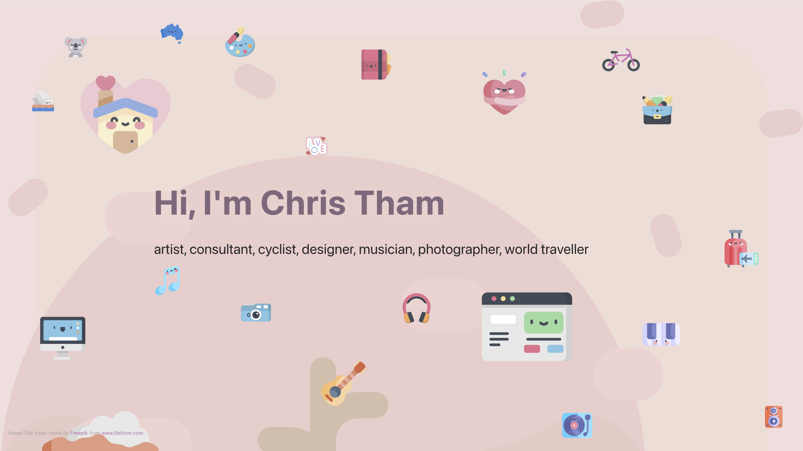

# Chris Tham Portfolio

Chris Tham Portfolio is a [Gatsby Cloud](https://www.gatsbyjs.com/cloud/) site built using
[gatsbyjs](https://www.gatsbyjs.com), based on
[gatsby-starter-portfolio-cara](https://cara.lekoarts.de). Rosely design theme,
with [Kawaii Flat Icons](https://www.flaticon.com/authors/kawaii/flat).

[**Website**](https://portfolio.christham.net)

## ✨ Features

- Theme UI-based theming with light and dark modes
- react-spring parallax effect
- CSS Animations on Kawaii Flat Icons from freepik
- React Typed
- optimised images via gatsby-images
- Inline SVG with react-svg
