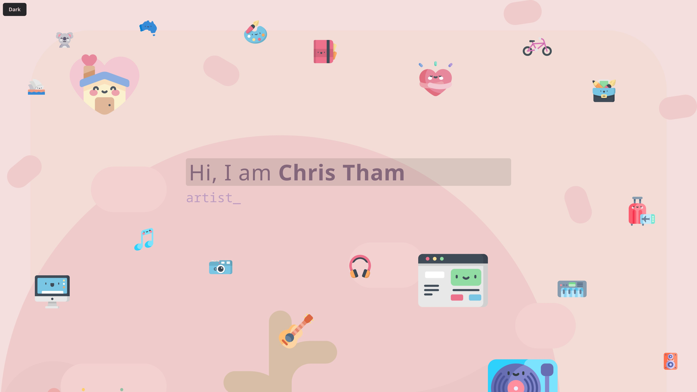

# Chris Tham Portfolio

[](https://app.netlify.com/projects/christham-portfolio/deploys)



Chris Tham Portfolio is a personal site built with [Astro](https://astro.build)
and [Tailwind CSS](https://tailwindcss.com), inspired by
[gatsby-starter-portfolio-cara](https://cara.lekoarts.de), using a visual theme
based on the [Rosely palette](src/styles/global.css) and
[Kawaii Flat Icons](https://www.flaticon.com/authors/kawaii/flat).

[**Website**](https://portfolio.christham.net)

## Migration Status

This project has completed a multi-step migration:

1. Gatsby -> Next.js (2025)
2. Next.js -> Astro (2026)

The current codebase is Astro-first, component-driven, and uses Astro Content Collections
for structured content.

## Features

- Fast, modern portfolio site built with [Astro](https://astro.build) and [Tailwind CSS](https://tailwindcss.com)
- Responsive design that works across desktop and mobile
- Light and dark mode toggle on the page
- Smooth layered scrolling effects
- Animated intro text in the hero section
- SVG icons and optimized project images
- Project and section content managed from structured content files
- Centralised colour and theme styling based on [Rosely](https://rosely.hellotham.com)
- Automated checks for code quality and tests

## Current Project Structure

```text
src/
  assets/
    backgrounds/           # Section background SVG images
    icons/                 # SVG icon assets
    portfolio/             # Optimized project card images
  components/              # Astro UI sections and primitives
    About.astro
    Contact.astro
    Content.astro
    Divider.astro
    Footer.astro
    Hero.astro
    Icon.astro
    Inner.astro
    Parallax.astro
    ParallaxLayer.astro
    ProjectCard.astro
    Projects.astro
  content/
    Projects/              # Project entries (Markdown)
    Sections/              # Section content (Markdown)
  content.config.ts        # Astro content collection definitions
  layouts/
    Layout.astro
  lib/
    site-metadata.ts
    utils.ts
  pages/
    404.astro
    index.astro
  scripts/
    parallax.ts
  styles/
    global.css
  test/
    content-structure.test.ts
    parallax.test.ts
    theme.test.ts
    utils.test.ts
```

## Getting Started

Prerequisites:

- Node.js 20+
- pnpm 10+

Install and run:

```bash
pnpm install
pnpm dev
```

## Scripts

- `pnpm dev` - run local development server
- `pnpm build` - create production build
- `pnpm preview` - preview production build locally
- `pnpm check` - run Astro diagnostics/type checks
- `pnpm lint` - run ESLint
- `pnpm test` - run Vitest suite
- `pnpm additem <url>` - create a project entry from a URL (infers title/body, captures a 4K screenshot)
- `pnpm updateitem` - refresh all existing project entries from their source URLs
- `pnpm clean` - remove generated and dependency folders
- `pnpm refresh` - run Astro upgrade helper and update dependencies

## Content Authoring

Projects are managed as Markdown entries in `src/content/Projects` and rendered
by the projects section component.

Each project file uses frontmatter for structured fields:

- `title`
- `link`
- `image`
- `weight` (optional; weighted entries are shown first)

The project card description is the Markdown body content (instead of a
frontmatter field).

Each project entry stores `image` as a relative file reference (for example
`../../assets/portfolio/learning-jamstack.jpg`) and is validated by the
`Projects` collection schema (`image()`), enabling optimized image rendering.

Project card backgrounds are generated at render time with random
`linear-gradient(...)` combinations from the Rosely palette tokens.

### Add Portfolio Item From URL

Use the URL ingestion script to create a new project entry with inferred content
and a screenshot:

```bash
pnpm additem https://example.com
```

What it does:

- Fetches the page and infers `title` from metadata/title tags
- Infers a short description paragraph for the markdown body
- Captures a 4K 16:9 screenshot and saves it under `src/assets/portfolio`
- Creates a markdown file under `src/content/Projects`

Use `--dry-run` to preview without writing files:

```bash
pnpm additem https://example.com --dry-run
```

### Refresh Existing Portfolio Items

Use the update script to re-fetch all existing project entries and refresh their
title, link, image screenshot, and markdown description from each project's URL:

```bash
pnpm updateitem
```

Use `--dry-run` to validate without writing changes:

```bash
pnpm updateitem --dry-run
```

About/contact copy is managed as Markdown entries in `src/content/Sections` and
rendered through the `Sections` collection.

Section background illustrations are sourced from `src/assets/backgrounds` and
imported in components as module assets.

## Styling and Interaction Notes

- Light/dark mode is toggled from the hero section and persisted with `localStorage`.
- Theme values are defined as CSS custom properties in `src/styles/global.css`.
- Source files use relative import paths (no `@/` alias or custom TypeScript path mappings).
- Parallax layers use `data-parallax-*` attributes and are updated by
  `src/scripts/parallax.ts` on scroll/resize, with an initial `requestAnimationFrame`
  pass to reduce first-paint jumps.

## How Animation Effects Are Achieved

This site uses a few focused animation techniques that work together:

- Layered parallax scrolling:
  Content sections are rendered as layers with offset/speed values.
  As you scroll, `src/scripts/parallax.ts` recalculates each layer's vertical
  position and updates `transform: translateY(...)` to create depth.

- Floating icon motion:
  Hero icons are grouped into containers that use CSS keyframes
  (`up-down` and `up-down-wide`) for gentle vertical movement.
  These are applied with Tailwind animation utility classes.

- Typed hero text:
  The role text in the hero is animated with `typed.js`, cycling through words
  using type speed, backspace speed, and delay settings.

- Blinking cursor effect:
  The typed cursor is styled globally with a custom blink keyframe
  (`typed-cursor-blink`) so it stays visually consistent with the hero text.

- First-paint stability:
  Parallax transforms are set immediately and then re-applied in
  `requestAnimationFrame` so the initial frame is positioned correctly and
  avoids visible jumps.
