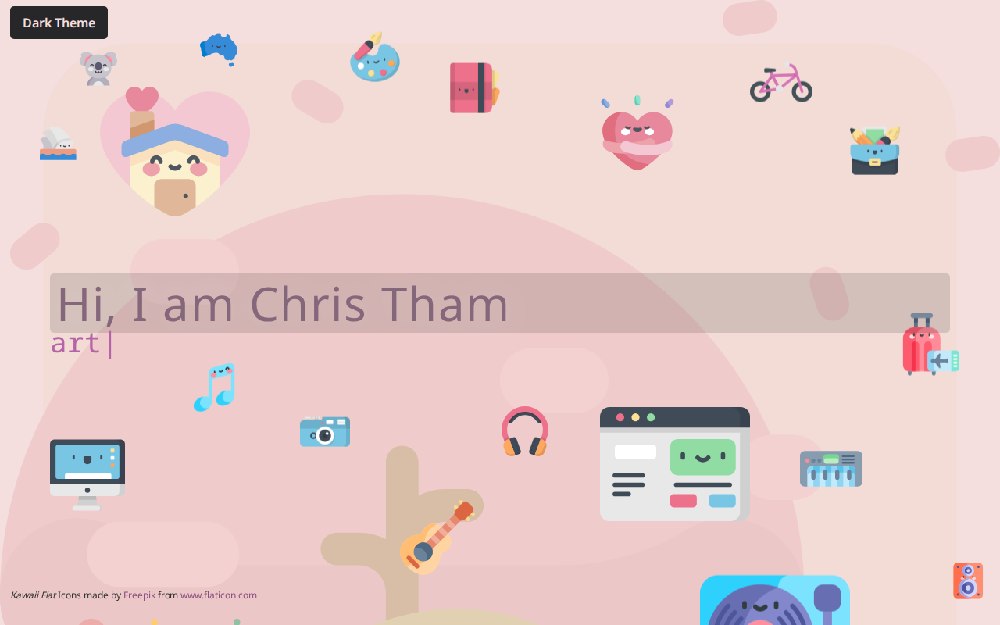

# Chris Tham Portfolio

[](https://app.netlify.com/projects/christham-portfolio/deploys)



Chris Tham Portfolio is a personal site built with [Astro](https://astro.build),
inspired by [gatsby-starter-portfolio-cara](https://cara.lekoarts.de), using a
Rosely-inspired visual theme and [Kawaii Flat Icons](https://www.flaticon.com/authors/kawaii/flat).

[**Website**](https://portfolio.christham.net)

## Migration Status

This project has completed a multi-step migration:

1. Gatsby -> Next.js (2025)
2. Next.js -> Astro (2026)

The current codebase is Astro-first, component-driven, and uses Astro Content Collections
for structured content.

## Features

- Astro 6 with TypeScript
- Tailwind CSS v4 integration via Vite plugin
- Light/dark mode support
- Custom parallax behavior for layered sections
- Typed hero animation using [typed.js](https://github.com/mattboldt/typed.js/)
- Structured content with Astro Content Collections:
  - `Projects` collection (JSON entries)
  - `Sections` collection (Markdown entries)
- ESLint flat config with Astro, TypeScript, Tailwind, and accessibility rules
- Vitest unit tests

## Current Project Structure

```text
src/
  assets/
    icons/                 # SVG icon assets
  components/              # Astro UI sections and primitives
    About.astro
    Contact.astro
    Content.astro
    Divider.astro
    Footer.astro
    Hero.astro
    Icon.astro
    Inner.astro
    Parallax.astro
    ParallaxLayer.astro
    ProjectCard.astro
    Projects.astro
  content/
    Projects/              # Project entries (JSON)
    Sections/              # Section content (Markdown)
  content.config.ts        # Astro content collection definitions
  layouts/
    Layout.astro
  lib/
    site-metadata.ts
    utils.ts
  pages/
    404.astro
    index.astro
  scripts/
    parallax.ts
  styles/
    global.css
  test/
    content-structure.test.ts
    parallax.test.ts
    theme.test.ts
    utils.test.ts
  theme/
    index.ts
```

```text
public/
  backgrounds/             # Section background images
  portfolio/               # Portfolio card images
```

## Getting Started

Prerequisites:

- Node.js 20+
- pnpm 10+

Install and run:

```bash
pnpm install
pnpm dev
```

## Scripts

- `pnpm dev` - run local development server
- `pnpm build` - create production build
- `pnpm preview` - preview production build locally
- `pnpm check` - run Astro diagnostics/type checks
- `pnpm lint` - run ESLint
- `pnpm test` - run Vitest suite
- `pnpm clean` - remove generated and dependency folders
- `pnpm refresh` - run Astro upgrade helper and update dependencies

## Content Authoring

Projects are managed as JSON entries in `src/content/Projects` and rendered by
the projects section component.

About/contact copy is managed as Markdown entries in `src/content/Sections` and
rendered through the `Sections` collection.
